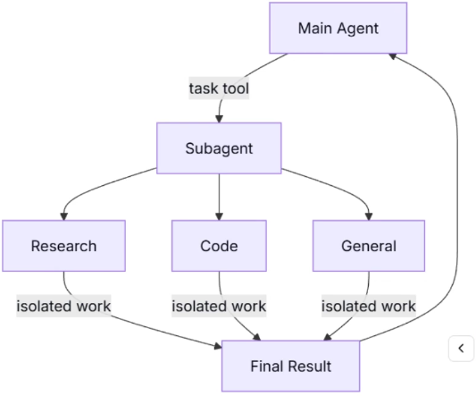

# Subagents


## 1. Defining Subagents
Subagents are created and called by the primary agent. They have independent system prompt, tool set and **context**.

## 2. Core tool: `task()`
The `task()` tool is the core tool for subagents to decide delegate tasks.
2 main parameters:
- `name` (str): the name of the subagent to call
- `task` (str): the task description to delegate

## 3. Low-level Engine: `SubAgentMiddleware`
`SubAgentMiddleware` is a middleware of LangChain/DeepAgents to realize `task()` tool.
- Add `SubAgentMiddleware` and available agents when creating the primary agent.
- When the primary agent calls `task()`, `SubAgentMiddleware` will intercept this call.
- Based on the `name` from the `task()` call, `SubAgentMiddleware` will find the corresponding subagent, initiate the subagent with configuration (system prompt, tools, model)
- In a isolated context, pass the `task` to the subagent and get the result (one or multiple `AIMessae`), pack as a `ToolMessage` return to the primary agent.

## 4. Create subagent:
1. Use dict, need to configure below parameters, very similar to LangGraph's traditional child agent
   - `name`
   - `description`
   - `system_prompt`
   - `tools`
   - `model`
2. Use precompiled graph (CompiledSubAgent): use LangGraph's StateGraph as subagent or a LangChain's `create_agent()` as agent, similar to my [Quantitative Finance RAG](https://github.com/lituokobe/Quantitative-Finance-RAG) agent.
    ```python
    # 1. Build a custom LangGraph (e.g., a two-step graph of search then analysis)
    def search_node(state: MessagesState):
        # Simulate search step
        return {"messages": [HumanMessage(content=f"Searched: {state['messages'][-1].content}")]}
    
    def analysis_node(state: MessagesState):
        # Simulate analysis step
        return {"messages": [HumanMessage(content="Analysis result. The conclusion is: Great potential.")]}
    
    builder = StateGraph(MessagesState)
    builder.add_node("search", search_node)
    builder.add_node("analysis", analysis_node)
    builder.add_edge(START, "search")
    builder.add_edge("search", "analysis")
    custom_graph = builder.compile()
    
    # 2. Wrap the compiled graph into a CompiledSubagent
    custom_subagent = CompiledSubagent(
        name="advanced-analyzer",
        description="Executes a complex workflow of search followed by deep analysis.",
        runnable=custom_graph  # Must be a compiled Runnable
    )
    
    # 3. Create the main Agent
    agent = create_deep_agent(
        model="gpt-4o",
        subagents=[custom_subagent]
    )
    ```
3. df


